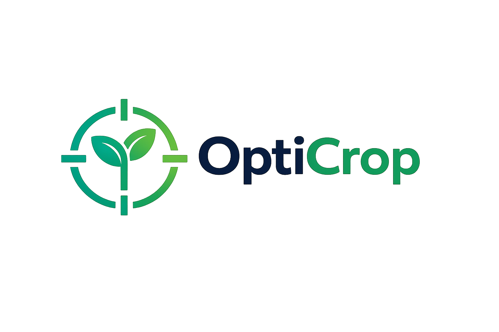
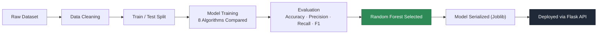
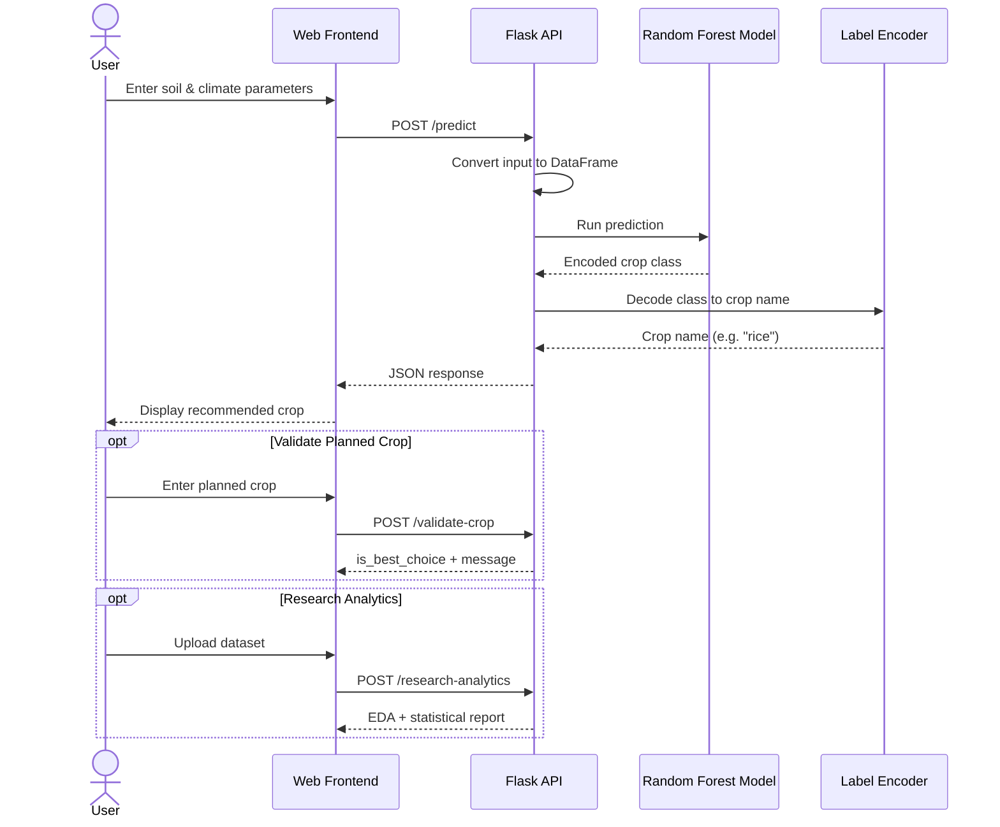
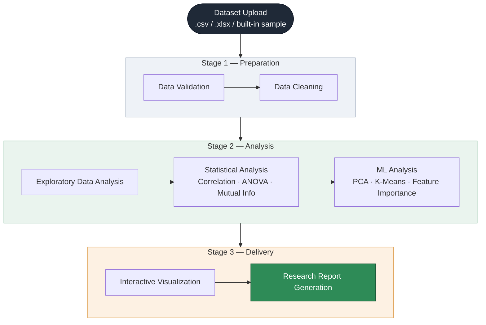

<div align="center">



# OptiCrop
### Smart Agricultural Production Optimization Engine

**An intelligent, ML-powered decision support system for crop recommendation, suitability analysis, and agricultural research analytics.**

<p>
  
  
  
  
  
  
</p>

<p>
  
  
  
  
</p>

<p>
  <a href="#features">Features</a> •
  <a href="#quick-start">Quick Start</a> •
  <a href="#api-endpoints">API</a> •
  <a href="#machine-learning-model">ML Model</a> •
  <a href="#research-analytics-workflow">Analytics</a> •
  <a href="#authors">Authors</a>
</p>

</div>

> [!NOTE]
> Place your logo file at `assets/logo.png` in the repository root (recommended: 512x512 PNG, transparent background). The image above is a placeholder reference until that file is added.

---

## Overview

**OptiCrop** bridges the gap between agriculture and artificial intelligence. It combines a high-accuracy **Random Forest** classifier with a full-featured **Flask** web application to help farmers pick the right crop for their soil and climate conditions, while giving researchers a self-service analytics engine to explore agricultural datasets without writing a single line of code.

> [!TIP]
> Whether you're a farmer validating a planting decision or a researcher exploring a new dataset, OptiCrop turns raw soil and environmental data into actionable, explainable recommendations.

---

## Table of Contents

<table>
<tr>
<td width="33%" valign="top">

**Getting Started**
- [Features](#features)
- [Project Objectives](#project-objectives)
- [Quick Start](#quick-start)
- [Installation](#installation)

</td>
<td width="33%" valign="top">

**Core System**
- [Technology Stack](#technology-stack)
- [Machine Learning Model](#machine-learning-model)
- [Project Structure](#project-structure)
- [API Endpoints](#api-endpoints)

</td>
<td width="33%" valign="top">

**Reference**
- [How It Works](#how-it-works)
- [Research Analytics Workflow](#research-analytics-workflow)
- [Testing](#testing)
- [Future Enhancements](#future-enhancements)
- [Authors & Acknowledgements](#authors)

</td>
</tr>
</table>

---

## Features

<table>
<tr>
<td width="33%" valign="top">

### Crop Recommendation

Predicts the most suitable crop from seven key inputs:

- Nitrogen (N)
- Phosphorus (P)
- Potassium (K)
- Temperature
- Humidity
- Soil pH
- Rainfall

Powered by a trained Random Forest model with 99.32% accuracy.

</td>
<td width="33%" valign="top">

### Crop Suitability Evaluation

Farmers input their planned crop, and OptiCrop compares it against the ML-recommended crop for the given conditions, instantly flagging whether the choice is optimal.

Returns a clear verdict plus an alternative suggestion when needed.

</td>
<td width="33%" valign="top">

### Research Analytics Dashboard

Automatic exploratory analysis for any uploaded dataset:

- Missing value and quality checks
- Correlation and PCA
- K-Means clustering
- ANOVA and Mutual Information
- Feature importance
- Auto-generated report

</td>
</tr>
</table>

> [!NOTE]
> The analytics module supports both user-uploaded datasets (`.csv` / `.xlsx`) and a built-in sample dataset, making it usable out of the box.

---

## Project Objectives

| Audience | Objective |
|:---|:---|
| Farmers | Select the best crop for local soil and climate conditions |
| Farmers | Reduce crop failure risk through data-driven decisions |
| Farmers | Validate planting decisions before committing resources |
| Researchers | Access automated, no-code dataset analytics |
| Researchers | Generate statistical and ML-based insight quickly |
| Researchers | Produce shareable research reports |
| Platform | Deliver fast, reliable ML predictions via a web application |
| Platform | Remain scalable and accessible from any browser |

---

## Technology Stack

<div align="center">

| Layer | Technologies |
|:---|:---|
| **Backend** |   Flask-CORS |
| **Machine Learning** |  Random Forest Classifier, Pandas, NumPy, Joblib |
| **Frontend** |    |
| **Visualization** | Matplotlib, Plotly, Seaborn |

</div>

---

## Machine Learning Model

### Dataset

Crop Recommendation Dataset (sourced from Kaggle) — soil nutrient and climate readings mapped to optimal crop labels.

### Pipeline



### Input Features → Output

| Input Features | Output |
|:---|:---|
| Nitrogen, Phosphorus, Potassium, Temperature, Humidity, pH, Rainfall | Recommended Crop |

### Models Evaluated

| # | Model | Status |
|:--:|:---|:--:|
| 1 | Logistic Regression | Tested |
| 2 | Decision Tree | Tested |
| 3 | K-Nearest Neighbors | Tested |
| 4 | **Random Forest** | **Selected** |
| 5 | Gradient Boosting | Tested |
| 6 | Extra Trees | Tested |
| 7 | Gaussian Naive Bayes | Tested |
| 8 | Support Vector Machine | Tested |

### Final Model Performance — Random Forest Classifier

<div align="center">

| Metric | Score |
|:---|---:|
| **Accuracy** | `99.32%` |
| **Precision** | `99.35%` |
| **Recall** | `99.32%` |
| **F1 Score** | `99.32%` |

</div>

```text
Accuracy   ███████████████████████████████████████ 99.32%
Precision  ███████████████████████████████████████ 99.35%
Recall     ███████████████████████████████████████ 99.32%
F1 Score   ███████████████████████████████████████ 99.32%
```

> [!IMPORTANT]
> The Random Forest model was selected as the final deployment model due to its superior accuracy, robustness to noisy features, and consistent performance across cross-validation folds.

---

## Project Structure

```text
OptiCrop/
│
├── app.py                                   # Flask application entry point
├── opticrop_research_analytics_endpoint.py  # Analytics engine (EDA, stats, ML)
├── assets/
│   └── logo.png                             # Project logo
├── models/                                  # Trained model artifacts (.pkl)
├── templates/                               # HTML templates (Jinja2)
├── static/                                  # CSS, JS, images
├── requirements.txt                         # Python dependencies
└── README.md                                # Project documentation
```

---

## API Endpoints

<div align="center">

| Method | Endpoint | Description |
|:--:|:---|:---|
| `GET` | `/` | Home Dashboard |
| `POST` | `/predict` | Crop Recommendation |
| `POST` | `/validate-crop` | Crop Suitability Evaluation |
| `POST` | `/research-analytics` | Research Analytics |

</div>

<details>
<summary><b>GET /</b> — Home Dashboard</summary>

Returns the OptiCrop web dashboard.

</details>

<details>
<summary><b>POST /predict</b> — Crop Recommendation</summary>

**Request**

```json
{
  "N": 90,
  "P": 42,
  "K": 43,
  "temperature": 20.8,
  "humidity": 82,
  "ph": 6.5,
  "rainfall": 202.9
}
```

**Response**

```json
{
  "success": true,
  "predicted_crop": "rice"
}
```

</details>

<details>
<summary><b>POST /validate-crop</b> — Crop Suitability Evaluation</summary>

**Request**

```json
{
  "crop": "cotton",
  "N": 90,
  "P": 42,
  "K": 43,
  "temperature": 20.8,
  "humidity": 82,
  "ph": 6.5,
  "rainfall": 202.9
}
```

**Response**

```json
{
  "success": true,
  "planned_crop": "cotton",
  "recommended_crop": "rice",
  "is_best_choice": false,
  "message": "cotton is not the optimal crop. We recommend growing rice instead."
}
```

</details>

<details>
<summary><b>POST /research-analytics</b> — Research Analytics</summary>

Accepts uploaded `.csv` / `.xlsx` datasets, or falls back to the built-in sample dataset. Returns full EDA, statistical, and ML-based analytics results.

</details>

---

## Quick Start

```bash
# 1. Clone the repository
git clone https://github.com/mani9441/OptiCrop.git

# 2. Navigate to the project
cd 5.Project_Development/d_development_integration

# 3. Set up a virtual environment
python3 -m venv venv
source venv/bin/activate        # Windows: venv\Scripts\activate

# 4. Install dependencies
pip install -r requirements.txt

# 5. Run the app
python app.py
```

Then open **`http://127.0.0.1:7000`** in your browser.

---

## Installation

### Prerequisites

- Python 3.10+
- pip
- Git

### Step-by-Step

<table>
<tr><th width="60">#</th><th>Step</th><th>Command</th></tr>
<tr><td>1</td><td>Clone the repo</td><td><code>git clone https://github.com/mani9441/OptiCrop.git</code></td></tr>
<tr><td>2</td><td>Enter project folder</td><td><code>cd 5.Project_Development/d_development_integration</code></td></tr>
<tr><td>3</td><td>Create virtual environment</td><td><code>python3 -m venv venv</code></td></tr>
<tr><td>4</td><td>Activate environment</td><td><code>source venv/bin/activate</code> (Linux/macOS) / <code>venv\Scripts\activate</code> (Windows)</td></tr>
<tr><td>5</td><td>Install dependencies</td><td><code>pip install -r requirements.txt</code></td></tr>
<tr><td>6</td><td>Run the application</td><td><code>python app.py</code></td></tr>
</table>

**Application URL:** `http://127.0.0.1:7000`

---

## How It Works



---

## Research Analytics Workflow



| Stage | Step | Description |
|:---|:---|:---|
| Preparation | Data Validation | Checks structure, types, and completeness |
| Preparation | Data Cleaning | Handles missing values and inconsistencies |
| Analysis | Exploratory Data Analysis | Summary statistics and distribution analysis |
| Analysis | Statistical Analysis | Correlation, ANOVA, Mutual Information |
| Analysis | ML Analysis | PCA, K-Means Clustering, Feature Importance |
| Delivery | Visualization | Interactive Plotly / Matplotlib / Seaborn charts |
| Delivery | Report Generation | Consolidated, exportable research report |

---

## Testing

OptiCrop has passed functional, performance, and user acceptance testing across all modules.

<div align="center">

| Test Area | Status |
|:---|:--:|
| Input validation | Passed |
| Crop prediction | Passed |
| Crop suitability evaluation | Passed |
| API testing | Passed |
| Frontend integration | Passed |
| Dataset analysis | Passed |
| Performance testing | Passed |
| End-to-end workflow validation | Passed |

</div>

**Average prediction response time:** `0.4 – 0.8 seconds`
**Prediction accuracy:** `99.32%` under repeated request testing

---

## Future Enhancements

- [ ] Weather API integration
- [ ] Soil image analysis
- [ ] Fertilizer recommendation
- [ ] Disease detection
- [ ] Yield prediction
- [ ] Multi-language support
- [ ] Cloud deployment
- [ ] Mobile application
- [ ] GIS and satellite data integration
- [ ] Explainable AI (XAI) recommendations

---

## License

This project is developed for academic and educational purposes.

---

## Authors

<div align="center">
<table>
<tr>
<td align="center">
<br/>
<b>Manikanta Kalyanam</b><br/>
<a href="https://github.com/mani9441">

</a>
</td>
<td align="center">
<br/>
<b>Mannava Sri Teja</b><br/>
<a href="https://github.com/sriteja-mannava">

</a>
</td>
</tr>
</table>
</div>

---

## Acknowledgements

- [Scikit-Learn](https://scikit-learn.org/)
- [Flask](https://flask.palletsprojects.com/)
- [Pandas](https://pandas.pydata.org/)
- [NumPy](https://numpy.org/)
- [Joblib](https://joblib.readthedocs.io/)
- [Crop Recommendation Dataset (Kaggle)](https://www.kaggle.com/datasets/chitrakumari25/smart-agricultural-production-optimizing-engine)

---

## About OptiCrop

OptiCrop is designed to bridge the gap between agriculture and artificial intelligence by combining machine learning, statistical analytics, and an intuitive web interface. It enables farmers to make informed crop selection decisions while providing researchers with tools to analyze agricultural datasets, promoting data-driven and sustainable farming practices.

<div align="center">

**Built for a smarter, data-driven agricultural future.**

</div>